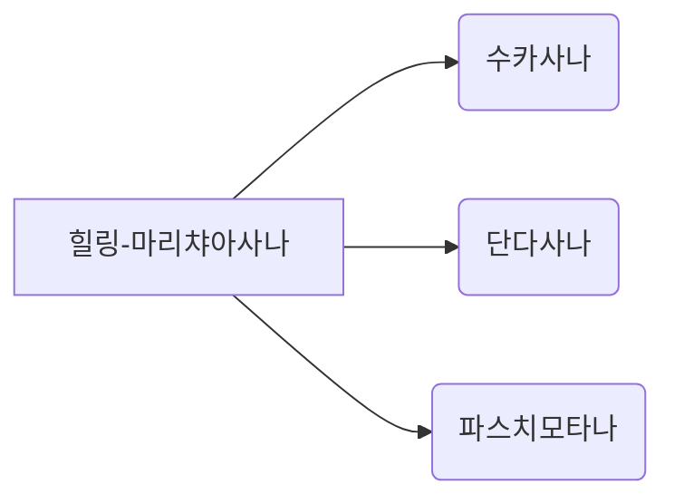

 
# Yoga Sequence Notes
 
요가 수업 시퀀스를 **MD 노트 + 마인드맵 이미지**로 정리한다.  
입력·수정 시 **파일 생성과 로컬 미리보기는 자동**, **커밋·배포는 사용자 요청 시에만**.
 
> **이전 `yoga-sequence-mindmapper`(React/D3 JSON 앱)와 별개.**
 
## 스킬 위치 (source of truth)
 
| 위치 | 용도 |
|------|------|
| **repo** `skills/yoga-sequence-notes/` | Git 버전 관리 — **이 경로가 기준** |
| `~/.claude/skills/yoga-sequence-notes/` | Claude Code — repo와 동기화해서 사용 |
| `.cursor/skills/yoga-sequence-notes/` | Cursor (선택) — repo에서 복사 |
 
스킬 수정 시 **repo에 먼저 커밋** → 로컬 스킬 폴더에 동기화.
 
**스킬 수정 체크리스트**
1. **repo 먼저 수정**: `skills/yoga-sequence-notes/SKILL.md` (source of truth)
2. 로컬 스킬 폴더(`~/.claude/skills/yoga-sequence-notes/`)와 내용이 다르면 동기화 — **단, 커밋은 repo 버전에만**
3. 배포 전 `git status`로 `skills/yoga-sequence-notes/SKILL.md` 변경 여부 확인
## Repo
 
| 항목 | 값 |
|------|-----|
| GitHub | https://github.com/imjhua/yoga-sequence-notes |
| 로컬 경로 | `~/Projects/yoga-sequence-notes` |
| MD | `sequences/*.md` |
| 프롬프트 | `sequences/prompts/*.prompt.txt` |
| 마인드맵 | `public/mindmaps/seq{N}-mindmap.svg`를 직접 `img`로 넣지 말고 `<Mindmap name="seq{N}" />`로 렌더링 (간단한 시각화는 Mermaid 코드블럭으로도 가능) |
| 로컬 미리보기 | `npm run dev` → http://localhost:5173 |
| Production | https://yoga-sequence-notes.vercel.app |
 
---
 
## 행동 규칙 (필수)
 
### 🤖 자동 — 별도 지시 없이 즉시 실행
 
사용자가 **요가 시퀀스를 입력·붙여넣기·수정**하면 (트리거 키워드 없어도):
 
**`theme: 빈야사`** (가사 플로우 — [vinyasa-lyric-template.md](references/vinyasa-lyric-template.md))
 
1. 사용자가 **채팅에 영어 가사** 제공 (줄바꿈 = 구절) — **Studio 입력 UI 사용 안 함**
2. `sequences/prompts/seq{N}-{slug}.prompt.txt` 저장 (원문만)
3. 에이전트가 구절마다 **한국어 번역** (수업 cue 톤, 기계번역 API 사용 금지)
4. `node scripts/build-vinyasa-json.js … --prompt … --ko …` 로 JSON 생성
5. `node scripts/sync-vinyasa.js` · MD에 `<LyricFlowStudio name="…" />` (initial-lyrics **없음**)
6. validate:vinyasa · dev 서버 · 미리보기 URL
**inhale/exhale · 강조 · 메모(자세)** 는 사용자가 Studio에서만 설정.
 
**그 외 테마 (힐링 등)**
1. `sequences/seq{N}-*.md` 작성 또는 수정
   - **참고 링크 (선택)**: 제목 라인에 · `[수업명](/link)` 추가 (독립 섹션 X, 인라인만)
2. 프롬프트에서 본문이 바뀌었거나 MD를 다시 썼다면 `python3 scripts/generate-mindmap.py seq{N}`로 **반드시 마인드맵 재생성**
   - 섹션명·부제가 바뀌면 `scripts/generate-mindmap.py`의 `PRESETS`도 먼저 맞춘 뒤 생성
   - 생성 후 `public/mindmaps/seq{N}-mindmap.svg`가 실제로 갱신됐는지 확인
3. 신규 시퀀스면 `sequences/index.md` + `.vitepress/config.ts` 업데이트
4. `node scripts/validate-sequence.js` 실행
5. **로컬 dev 서버 기동** — 아래 [로컬 서버](#로컬-서버-자동-기동) 참고
6. 사용자에게 **미리보기 URL** 안내
**수정 후에도 동일** — MD/마인드맵/sidebar 갱신 → validate → dev 서버 확인 → URL 안내.
 
**아사나 세분화 규칙**
- 엎드린 흐름이 들어오면 `마카라사나` / `부장가사나` / `다누라사나`를 **하나의 표 안에서** 정리한다. 표를 여러 개로 쪼개지 말고, 포즈명이 바뀌는 지점에서 시작 행을 다시 써서 블록 경계를 보여준다.
- 한 섹션 안에서 아사나가 바뀌어도 표는 유지하고, `**아사나명**` 행을 반복해서 새 블록처럼 읽히게 만든다.
- 단순 휴식형 엎드림, 팔로 밀어 올리는 백벤드, 다리 잡고 올리는 백벤드는 서로 다른 아사나로 취급한다.
- 사용자가 한 블록 안에서 여러 아사나 이름을 함께 써도, 실제 cue가 바뀌면 MD에서는 아사나 단위를 나눠 읽기 쉽게 정리한다.
- 마인드맵 preset도 이 분리 기준에 맞게 섹션 제목이나 부제를 조정한다.
- 마인드맵 SVG는 CSS 변수로 색을 먹이므로, MD에서 직접 이미지 링크로 참조하지 말고 반드시 `Mindmap` 컴포넌트로 넣는다. 그래야 라이트/다크 모드와 배경이 정상 렌더링된다.

 - 간단한 마인드맵은 Mermaid 코드블럭으로도 삽입할 수 있습니다. 예:



   Mermaid는 클라이언트에서 CDN으로 동적 로드되어 자동 렌더링됩니다. 복잡한 레이아웃이나 스타일 제어가 필요하면 기존 `generate-mindmap.py`로 SVG를 생성하세요.
**오타 보정 규칙**
- 사용자가 준 프롬프트나 기존 초안에 보이는 명백한 오타는 MD로 옮길 때 자연스럽게 보정한다.
- 맞춤법이 흔들려도 cue 의미가 분명하면 의미를 유지하면서 표준 표기로 정리한다.
- 예: `옆구리가 길어지개` → `옆구리가 길어지게`
- 예: `오른족` → `오른쪽`
- 예: `합창`이 의도상 `합장`이면 문맥상 맞는 표현으로 보정한다.
### 🔄 프롬프트 변경 시 (기존 시퀀스)
 
사용자가 **기존 시퀀스의 특정 섹션만 프롬프트 변경**하면:
 
1. **변경 지점만 식별** — "프롬프트 변경. {섹션명} / 추가 라인 / 삭제 라인"
2. **새 시퀀스 생성 X** — 기존 시퀀스 파일만 업데이트
3. `sequences/prompts/seq{N}-*.prompt.txt` 해당 섹션만 수정
4. `sequences/seq{N}-*.md` 표만 갱신 (다른 섹션 터치 금지)
5. **마인드맵 업데이트 검토**:
   - 변경된 섹션이 **마인드맵 제목/부제와 관련**있으면 `scripts/generate-mindmap.py` 스크립트 수정
   - 마인드맵 preset 데이터와 실제 시퀀스가 일치하는지 확인
   - 본문을 다시 썼다면 `python3 scripts/generate-mindmap.py seq{N}` 재생성
   - 생성 후 `public/mindmaps/seq{N}-mindmap.svg`가 갱신됐는지 확인
6. validate · dev 미리보기 · URL 안내
**예시 1 (섹션명 변경 X):**
```
사용자: "프롬프트 변경. 수카사나 상단에 '두손 하늘 위로 뻗고' 등 3줄 추가해줘"
에이전트:
  1. seq{N} prompt.txt 수카사나 섹션만 수정
  2. seq{N} MD의 수카사나 표만 갱신 (다른 섹션 건드리지 않기!)
  3. 마인드맵 검토: "수카사나" → 제목 변경 없음 → 스크립트 수정 불필요
  4. validate · dev 확인 · URL 안내
```
 
**예시 2 (섹션명 변경 → 마인드맵 업데이트 필요):**
```
사용자: "프롬프트 변경. '다운독' 섹션명을 '다운독-테이블 전환'으로 바꾸고, 소고양이 플로우 추가해줘"
에이전트:
  1. seq{N} prompt.txt의 "다운독" 섹션을 "다운독-테이블 전환(소고양이)" 또는 유사하게 수정
  2. seq{N} MD 표 업데이트 + 섹션 제목 변경
  3. 마인드맵 검토: 마인드맵 PRESETS["seq{N}"]["steps"]의 해당 항목 수정
  4. `scripts/generate-mindmap.py` 해당 섹션의 제목·부제 수정 → 재생성
  5. validate · dev 확인 · URL 안내
```
 
### 🛑 수동 — 사용자가 배포를 요청할 때만
 
**커밋·push·배포는 사용자가 명시적으로 요청할 때만** 실행.
 
배포 요청 시: `npm run build` → git commit → push → Vercel 자동 재배포
 
---
 
## MD 포맷 (필수)
 
템플릿: [sequence-md-template.md](references/sequence-md-template.md)
 
| 영역 | 규칙 |
|------|------|
| 제목 | `{theme}-{peak_pose}` — 예: `힐링-사마코나사나` |
| 부제 | `**포커스:** … · **피크포즈:** …` (영어 산스크리트名 **금지**) — 선택적 참고 링크: · [`수업명`](/link) |
| 프론트매터 위치 | `---`로 시작하는 YAML frontmatter는 반드시 파일 맨 위(첫 줄)이어야 합니다. H1(`# ...`)보다 먼저 위치하지 않으면 frontmatter가 페이지 본문으로 렌더링됩니다. |
| **개요** | **`핵심 cue` 한 줄만** — 테마·총 시간 등 제거 |
| 표 | **3컬럼 고정**: 포즈 (15%) \| # (5%) \| 동작 (80%) — 호흡은 동작 내 `inhale`/`exhale` 배지 |
| index | `\| 수업 \| 포커스 \| 날짜 \|` — **최신순** |
 
본문 순서: **개요 → 수업 메모 → 시퀀스 본문 → 마인드맵 → 다음 수업 연결(필요 시) → 초기 프롬프트** (참고 링크는 제목 라인에만)
 
### 프롬프트 호흡 형식 자동 변환 규칙
 
입력 프롬프트 예시:
```
빌드업
* 욷카타사나
* 빈야사
* 마시는 숨: 한쪽다리 뒤로
* 내쉬는 숨: 무릎 접어 가슴 앞으로
* 마시는 숨: 전사1
* 내쉬는 숨: 전사2
```
 
변환 규칙:
- `* 포즈명` (호흡 없음): 새 섹션 시작 → `| **포즈명** | 1 | |`
  - 다음 호흡 정보부터 # 번호 증가
- `* 마시는 숨: 동작`: `| | # | `inhale` 동작 |` (# 증가)
- `* 내쉬는 숨: 동작`: `| | # | `exhale` 동작 |` (# 증가)
- **모든 표는 3컬럼 고정 유지**
**반대쪽 표기 규칙 (명시적):**
- **통일 대상:** `* (반대쪽)` (한 줄 전체가 "(반대쪽)"만 있는 경우) → MD: `| (반대쪽) |`
- **유지 대상 (건드리지 말 것):**
  - `* 반대쪽 …` (동작 설명 포함): 원문 유지 → `| 반대쪽 … |`
  - `* → 반대쪽`: 원문 유지 → `**→ 반대쪽**`
  - `* 반대쪽 다리`, `* 반대쪽 겨드랑이` 등 구체적 신체부위: 원문 유지
**예시 (통일 O):**
- 프롬프트: `* (반대쪽)` → MD: `| (반대쪽) |`
**예시 (원문 유지 X):**
- 프롬프트: `* 반대쪽 다리 넘어까지 길게 시선 …` → MD: `| 반대쪽 다리 넘어까지 길게 시선 … |`
- 프롬프트: `* 반대쪽 겨드랑이 안으로 …` → MD: `| 반대쪽 겨드랑이 안으로 … |`
변환된 MD 표:
```
| 포즈 | # | 동작 |
|------|---|------|
| **욷카타사나** | 1 | |
| **빈야사** | 2 | |
| **빌드업** | 3 | `inhale` 한쪽다리 뒤로 |
| | 4 | `exhale` 무릎 접어 가슴 앞으로 |
| | 5 | `inhale` 전사1 |
| | 6 | `exhale` 전사2 |
```
 
**빈야사 (`theme: 빈야사`)**: [vinyasa-lyric-template.md](references/vinyasa-lyric-template.md) — 가사 플로우 JSON + `<LyricFlow />`
 
### ❌ 하지 말 것
 
- [ ] 호흡을 4열 표로 만들기 — 항상 3컬럼(포즈 15% | # 5% | 동작 80%)으로 통합
- [ ] repo 없이 로컬 스킬 폴더만 수정하고 배포하기
- [ ] 스킬(`skills/yoga-sequence-notes/SKILL.md`) 수정 후 커밋 건너뛰기
- [ ] 표 너비 임의 변경 — 포즈 15% | # 5% | 동작 80% 고정
---
 
## 마인드맵 관리
 
### PRESETS 데이터 구조
 
마인드맵은 `scripts/generate-mindmap.py`의 `PRESETS` 딕셔너리에 의해 제어됩니다:
 
```python
"seq{N}": {
    "root": ("피크포즈명", "포커스 · 테마"),
    "steps": [
        ("섹션1 제목", "섹션1 부제"),
        ("섹션2 제목", "섹션2 부제"),
        # ... 더 많은 섹션
    ],
    "peak": ("피크포즈명", "피크 설명"),
}
```
 
### 유지보수 체크리스트
 
프롬프트/MD 수정 후 **반드시** 확인:
 
1. **마인드맵 제목이 실제 섹션명과 일치?**
   - `sequences/seq{N}-*.md`의 `## {N}. {섹션명}` vs `PRESETS["seq{N}"]["steps"][{N-1}][0]`
   - 일치하지 않으면 → `scripts/generate-mindmap.py` 수정
2. **마인드맵 부제가 실제 내용을 반영?**
   - 예: "계단타기 · 워밍업"이 실제로 "다운독-테이블 전환" 섹션에 없으면 → 수정 필요
   - 부제는 **섹션의 핵심 동작/포커스**를 간단히 표현
3. **신규 섹션 추가/삭제?**
   - 추가: `PRESETS["seq{N}"]["steps"]`에 새 튜플 추가
   - 삭제: 해당 튜플 제거
   - 재생성: `python3 scripts/generate-mindmap.py seq{N}`
4. **커밋 포함**:
   - `scripts/generate-mindmap.py` + `public/mindmaps/seq{N}-mindmap.svg` 함께 커밋
### 재생성 커맨드
 
```bash
# 단일 시퀀스 재생성
python3 scripts/generate-mindmap.py seq4
 
# 모든 시퀀스 재생성 (선택)
for seq in seq0 seq2 seq3 seq4 seq5 seq6; do
  python3 scripts/generate-mindmap.py "$seq"
done
```
 
---
 
```bash
cd ~/Projects/yoga-sequence-notes
npm run dev    # 미기동 시 백그라운드 (block_until_ms: 0)
```
 
---
 
## 전체 파이프라인
 
```
[자동] 입력/수정 → prompt → MD → mindmap → index/sidebar → validate → npm run dev
[수동] "배포해줘" → build → commit → push → Vercel
```
 
상세: [publish-workflow.md](references/publish-workflow.md)
 
---
 
## 워크플로우
 
### Phase 1: 입력 → 파일 생성 (자동)
 
| 필드 | 설명 |
|------|------|
| `theme` | 요가 타입 (힐링, 파워, …) |
| `peak_pose` | 피크포즈 (한글만) |
| `focus` | 수업 포커스 — index 2열 |
| `title` | `{theme}-{peak_pose}` |
| `duration` | frontmatter만 (개요에 노출 X) |
 
### Phase 2–5
 
마인드맵 · sidebar · validate · dev — [publish-workflow.md](references/publish-workflow.md) 참고.
 
### Phase 6: 커밋 & 배포 (사용자 요청 시)
 
```bash
npm run build
git add sequences/ skills/ public/mindmaps/ .vitepress/config.ts
git commit -m "Update yoga sequence: {title}"
git push origin main
```
 
---
 
## 리소스
 
- [sequence-md-template.md](references/sequence-md-template.md)
- [publish-workflow.md](references/publish-workflow.md)
- [mindmap-image-guide.md](references/mindmap-image-guide.md)
- [deploy-workflow.md](references/deploy-workflow.md)
- 표 스타일 CSS: `.vitepress/theme/custom.css` (94–142줄)